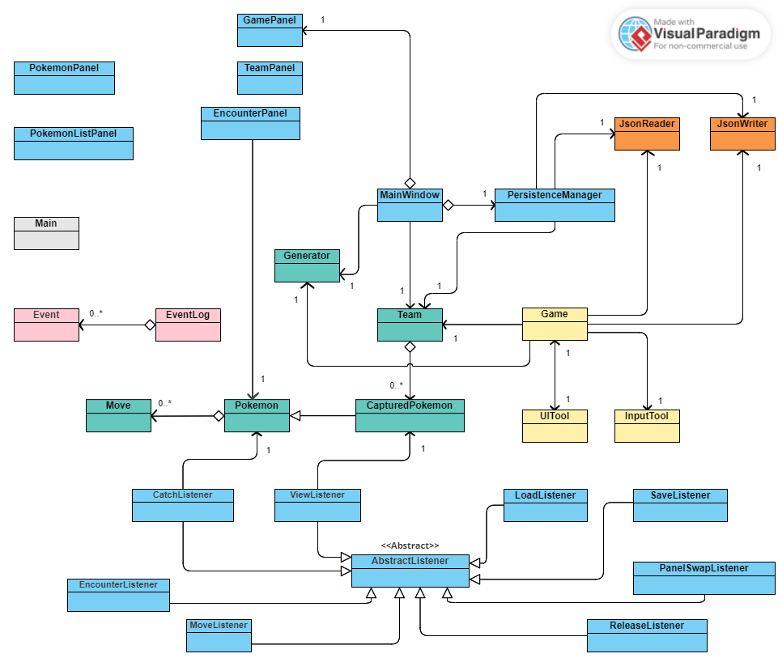

# Pokemon Lite

## About the Project
I owe my interest in Computer Science to video games. 

My first experiences with programming started out because of a desire 
to learn how to make my own video games. From there, one thing led to another,
and now, I'm hoping to pursue Computer Science and software development as a full-time career. 
With that said, it thus felt very fitting that as a  personal project, 
I would fulfill my younger self's dreams and create a simple video game. 
With *Pokemon Platinum* on the *3DS* being one of the first games I played as a kid, it 
felt right that I go full-circle and choose the Pokemon franchise as my inspiration.

This project is an offline, single-player video game that will aim to recreate some of the
key game mechanics and gameplay loop of the world-renowned Pokemon franchise. The game will be designed
to be playable on desktop, with casual gamers as the target demographic of users in mind. In particular, I hope that I, as well some of my friends, will be able to play
the finished product and find much enjoyment from it.

## User Stories
### Phase 1 User Stories: *A console game*
- As a user, I want to be able to catch Pokemon and **add** it to my team.
- As a user, I want to be able to **view** all the Pokemon on my team.
- As a user, I want to be able to **release** a Pokemon from my team.
- As a user, I want to be able to **set nicknames** for my Pokemon.
- As a user, I want to be able to **teach** my Pokemon new moves.
### Phase 2 User Stories: *Persistence*
- As a user, I want to have the option to **save** my progress in-game to a file.
- As a user, I want to have the option to **load** my previously saved progress from a file.
### Phase 3 Instructions: *A full GUI*
- You can add Pokemon to the Team by clicking 
**"Encounter Pokemon" > "Catch Pokemon"** from the main window.
- You can view the Pokemon on the Team by clicking **"View Team"** from the main window.
- You can teach a Pokemon a new Move by selecting 
**"View Team" > "Details" > "Learn New Move"**
- You can release a Pokemon from the team by selecting
**"View Team" > "Details" > "Release Pokemon"**
- You can save the state of my application by selecting **"Save Game"** on the main window.
- You can reload the state of my application by selecting **"Load Game"** on the main window.
### Phase 4: *Documentation*
#### Game Log
This sample sequence of actions during gameplay: 
> Load Game > Encounter Pokemon_1 > Flee Encounter > Encounter Pokemon_2 > Catch Pokemon_2 > 
> Team Menu > Teach Pokemon_2 New Move > Encounter Pokemon_3 > Catch Pokemon_3 > Team Menu >
> Release Pokemon_3 > Save Game

May produce the following log:

```
APP CLOSING... PRINTING SESSION LOG:

Mon Apr 08 02:18:22 PDT 2024
Player loaded game from memory.

Mon Apr 08 02:18:25 PDT 2024
Player encountered a wild Growlithe!

Mon Apr 08 02:18:25 PDT 2024
Growlithe learned Grass Punch!

Mon Apr 08 02:18:25 PDT 2024
Growlithe learned Fire Tackle!

Mon Apr 08 02:18:29 PDT 2024
Player encountered a wild Krabby!

Mon Apr 08 02:18:29 PDT 2024
Krabby learned Dark Slam!

Mon Apr 08 02:18:29 PDT 2024
Krabby learned Fire Rush!

Mon Apr 08 02:18:33 PDT 2024
Krabby has joined the team!

Mon Apr 08 02:18:40 PDT 2024
Krabby learned Electric Beam!

Mon Apr 08 02:18:45 PDT 2024
Player encountered a wild Nidoran!

Mon Apr 08 02:18:45 PDT 2024
Nidoran learned Flying Rush!

Mon Apr 08 02:18:45 PDT 2024
Nidoran learned Psychic Slash!

Mon Apr 08 02:18:47 PDT 2024
Nidoran has joined the team!

Mon Apr 08 02:18:54 PDT 2024
Nidoran has been set free!

Mon Apr 08 02:18:58 PDT 2024
Player saved game to memory.
```
*Note that due to the randomized nature of Pokemon and Move generation,*
*the **exact** values of the sample log cannot easily be recreated.*
#### UML Diagram & Analysis 


By studying my UML class diagram, I was able to notice a number of areas
which could be refactored if I were to spend time improving the design of my program.

To start, I noticed there was a significant amount of coupling between my `Team` model and the
GUI classes `MainWindow` and `PersistenceManager`. With the UML association arrows forming a 'triangle',
we know that coupling is not a good design practice, and so I would definitely look into refactoring these classes. 
One way I could think of doing this is through passing a reference around as a parameter 
instead of storing it as a field, removing an arrow and 'breaking' the coupling.

Additionally, in connection to the `PersistenceManager`, another change I'd
like to make involves my old console UI classes. When designing the console UI, I had the `Game` class associate
directly with `JsonReader` and `JsonWriter`. However, when I got to Phase 3, I created a `PersistenceManager` for the
GUI, abstracting away this behavior and reducing coupling. Hence, for the same benefits,
I'd also like to refactor my console UI to make use of this helpful manager class.

Next, in designing the UML diagram, I also noticed that I had some inconsistencies in my design. For example,
with my `Listeners`, some would hold direct references to objects (and hence have associations), while others
would only hold index values (and hence have a dependency which doesn't reflect on the UML). Though not much
would end up changing performance-wise, determining a consistent convention would definitely be a positive change 
for the code.

Another area of inconsistency involves my GUI. When adding panels to the main frame, most of the time,
I instantiate new panels during run-time. This results in dependencies which don't reflect in the diagram, making it
harder to understand how the different components of the GUI interact with each other. Refactoring by declaring 
 fields will make these implied aggregations explicit, which would make the UML diagram clearer
and more helpful.

Lastly, looking back, there were definitely some areas in my code where I now realize design patterns would
be very helpful. Using the `Singleton` pattern on my `Generator`, or applying the `Iterator` pattern for my `Team`,
for example, would bring about significant quality-of-life improvements, making it a lot easier to maintain the project.
